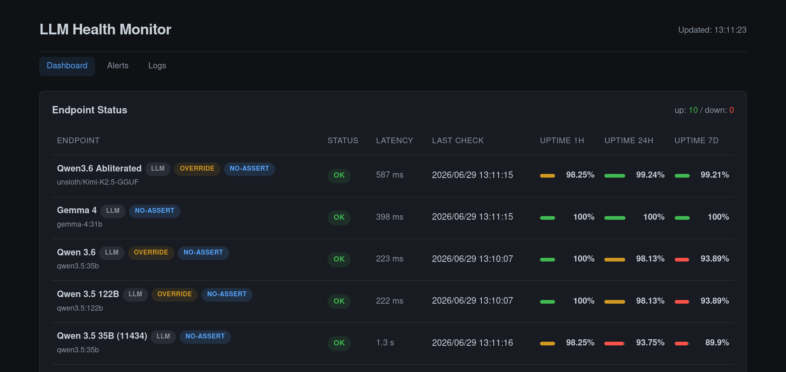

# LLM Health Monitor



A small FastAPI-based dashboard and async health checker for LLM, embedding, and rerank endpoints.

It polls each configured endpoint on its own schedule, records latency and response correctness to a local SQLite database, and renders a live web UI with status tables, per-endpoint latency charts, active alerts, and a debug request/response log.

## Features

- **Endpoint types**
  - `llm` — `POST /v1/chat/completions` with optional exact-response assertion
  - `embedding` — `POST /v1/embeddings` with optional expected dimension check
  - `rerank` — `POST /v1/rerank` with optional expected top-index check
- **Per-endpoint scheduling** — each endpoint can override interval, timeout, prompt/input, and assertion rules
- **Concurrent, non-blocking checks** — uses `httpx`, `aiosqlite`, and a shared `asyncio` event loop with FastAPI
- **Uptime tracking** — 1h, 24h, and 7-day uptime bars per endpoint
- **Alerting** — configurable ntfy.sh topic; stub hooks for email, Slack, and PagerDuty
- **Debug logs** — full request/response bodies for the latest checks
- **Timezone-aware** — timestamps and uptime windows respect `server.timezone`

## Project layout

```
.
├── app.py            # FastAPI server + Jinja2 HTML routes + JSON API
├── checker.py        # Background asyncio health-check loop
├── config.py         # Pydantic config schema and loader
├── config.yaml       # Endpoint and check settings
├── db.py             # Async SQLite layer
├── alerts.py         # Alert triggers and notification hooks
├── launch.sh         # Convenience launcher that activates venv and runs app.py
├── static/style.css  # Dashboard styles
├── templates/        # Jinja2 pages (dashboard, alerts, logs)
├── test_alert.py     # Standalone script to test alert integrations
└── requirements.txt  # Python dependencies
```

## Quick start

1. Create and activate a virtual environment:

   ```bash
   python3 -m venv venv
   source venv/bin/activate
   pip install -r requirements.txt
   ```

2. Edit `config.yaml` to add/remove endpoints, set the server host/port/timezone, and configure alerts.

3. Start the server:

   ```bash
   ./launch.sh
   ```

   Or directly with Python:

   ```bash
   python app.py
   ```

4. Open the dashboard at `http://<host>:<port>/` (default `http://0.0.0.0:9880/`).

## Configuration

Settings live in `config.yaml`. The top-level sections are:

- `endpoints` — list of endpoints to monitor
- `check` — default parameters for each endpoint type
- `server` — host, port, and timezone
- `alerts` — notification settings

### Endpoint fields

| Field            | Required | Description |
|------------------|----------|-------------|
| `monitor-id`     | yes      | Unique stable identifier for the endpoint |
| `name`           | yes      | Human-readable display name |
| `base_url`       | yes      | Root URL of the OpenAI-compatible API, e.g. `http://host:port/v1` |
| `api_key`        | no       | Bearer token; omit or leave empty if the endpoint needs no auth |
| `model`          | yes      | Model name passed in the request |
| `endpoint_type`  | yes      | One of `llm`, `embedding`, `rerank` |
| `enabled`        | no       | Default `true`; set `false` to stop checking without removing config |
| `show`           | no       | Default `true`; set `false` to hide from the UI while still checking |
| `check_override` | no       | Per-endpoint overrides of any `check.<type>` field |

### Global defaults (`check`)

#### `check.llm`

| Field             | Default                        | Description |
|-------------------|--------------------------------|-------------|
| `prompt_request`  | `"Say 'hello world' in two words"` | User prompt sent to the model |
| `prompt_expected` | `"hello world"`                | Exact response expected when `assert_response` is `true` |
| `temperature`     | `0`                            | Sampling temperature |
| `top_p`           | `1.0`                          | Nucleus sampling |
| `top_k`           | `0`                            | Top-k sampling (`0` = omitted) |
| `max_tokens`      | `10`                           | Max completion tokens |
| `assert_response` | `false`                        | Whether to require exact match |
| `timeout_seconds` | `10`                           | Request timeout |
| `interval_seconds`| `30`                           | Seconds between checks |
| `random_prefix`   | `true`                         | Prepend a UUID to defeat KV cache |
| `concurrency`     | `1`                            | Independent requests fired per cycle |

#### `check.embedding`

| Field               | Default         | Description |
|---------------------|-----------------|-------------|
| `input`             | `"Hello world"` | Input text to embed |
| `expected_dimension`| `1536`          | Expected embedding dimension; set `null` to skip |
| `assert_response`   | `false`         | If `true`, validate dimension |
| `timeout_seconds`   | `10`            | Request timeout |
| `interval_seconds`  | `30`            | Seconds between checks |
| `random_prefix`     | `false`         | Whether to prepend UUID to input |
| `concurrency`       | `1`             | Requests per cycle |

#### `check.rerank`

| Field            | Default                                                            | Description |
|------------------|--------------------------------------------------------------------|-------------|
| `query`          | `"What is the capital of France?"`                                 | Query string |
| `documents`      | `["Paris is the capital of France.", "Berlin is the capital of Germany.", "France is a country in Europe."]` | Docs to rerank |
| `expected_index` | `0`                                                                | Expected top result index; set `null` to skip |
| `assert_response`| `false`                                                            | If `true`, validate top index |
| `timeout_seconds`| `10`                                                               | Request timeout |
| `interval_seconds`| `30`                                                              | Seconds between checks |
| `random_prefix`  | `false`                                                            | Whether to prepend UUID to query |
| `concurrency`    | `1`                                                                | Requests per cycle |

### Server and alerts

```yaml
server:
  host: "0.0.0.0"
  port: 9880
  timezone: "Asia/Shanghai"

alerts:
  enabled: true
  ntfy_topic: "your-ntfy-topic"
```

Set `alerts.enabled: false` or omit `ntfy_topic` to silence notifications.

## Alert integrations

`alerts.py` contains four hooks:

- `send_ntfy_alert` — real implementation using ntfy.sh
- `send_email_alert` — stub
- `send_slack_alert` — stub
- `send_pagerduty_alert` — stub

To test the configured integrations without running the full app:

```bash
python test_alert.py
```

## JSON API

All HTML pages fetch data from these endpoints:

| Route | Description |
|-------|-------------|
| `GET /api/status` | Current status, latest check, and uptime for visible endpoints |
| `GET /api/history?monitor_id=<id>&hours=24` | Check history for one endpoint |
| `GET /api/alerts?active_only=false` | Recent alerts (resolved or active) |
| `GET /api/logs?limit=200` | Recent checks with full request/response bodies |

Only endpoints with `show: true` appear in the UI and API responses.

## Database

The checker stores data in `llm_monitor.db` (SQLite). Tables:

- `endpoints` — upserted from `config.yaml` on startup
- `checks` — one row per health check
- `alerts` — triggered and resolved alerts

You can inspect the database directly with any SQLite client.

## Development

### Running locally

```bash
source venv/bin/activate
python app.py
```

`launch.sh` does the same but also validates that `venv/bin/activate` exists and that `config.yaml` is present.

### Editing the UI

The frontend is plain HTML/JS served from `templates/` plus `static/style.css`. There is no build step.

**If you edit `static/style.css` and the browser still shows the old styles, force a cache bypass:**

- **Chrome / Edge:** `Ctrl + Shift + R` or `Ctrl + F5`
- **Firefox:** `Ctrl + Shift + R` or `Ctrl + F5`
- **Safari:** `Cmd + Option + R`

The templates currently load the stylesheet with a query-string cache-buster (`/static/style.css?v=2`). If you make a substantial CSS change, bump the `?v=` number in the relevant template `<link>` tags to ensure returning visitors pick up the new file.

### Adding a new endpoint type

1. Add defaults in `config.py` under `CheckConfig`.
2. Implement `_build_<type>_payload` and response validation in `checker.py`.
3. Add the new type to `EndpointConfig.endpoint_type` literal and to `effective()`.
4. Update the dashboard tooltip rendering in `templates/dashboard.html` if you want the effective config shown.

## Requirements

- Python 3.12+
- Dependencies listed in `requirements.txt`:
  - FastAPI + Uvicorn
  - httpx
  - aiosqlite
  - PyYAML
  - Jinja2
  - Pydantic v2
